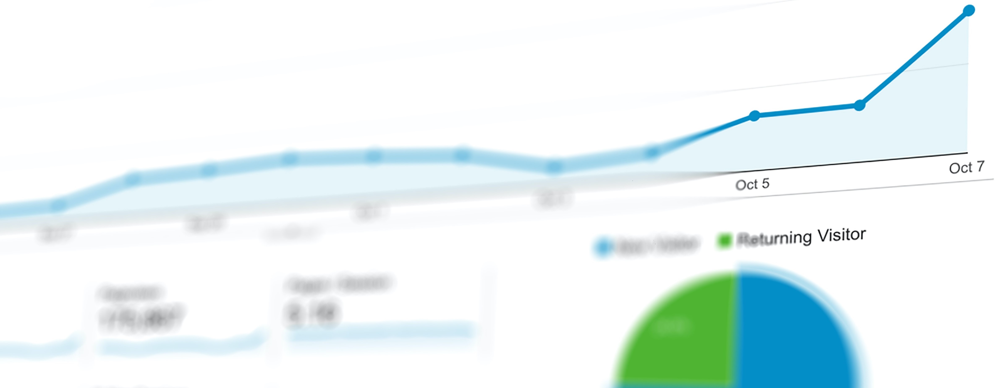

# Cleiton Ambrosio's Portfolio

<!--
**CleitonAmbrosio/CleitonAmbrosio** is a ✨ _special_ ✨ repository because its `README.md` (this file) appears on your GitHub profile.

Here are some ideas to get you started:

- 🔭 I’m currently working on ...
- 🌱 I’m currently learning ...
- 👯 I’m looking to collaborate on ...
- 🤔 I’m looking for help with ...
- 💬 Ask me about ...
- 📫 How to reach me: ...
- 😄 Pronouns: ...
- ⚡ Fun fact: ...
-->

## About

I am looking for opportunities a Data Scientist, and I also hold a MSc degree in Physics. I have been studying Data Science since April/2021 and, thus, I have 5 months of professional experience in the area by working in the projects detailed below.

### :toolbox: Toolbox

<!--
I have mastery of all stages of developing a business solution using the concepts and tools of Data Science, from understanding the business to publishing the model in production using Clouds.

I have already developed solutions for important business problems such as detecting fraud in transactions, classifying diseases early, identifying customers in churn and prioritizing customers for cross-selling.

The details of each solution are described in the projects below.

**Analytical Tools:**

**Data Collection and Storage:** SQL

**Data Processing and Analysis:** Python

**Development:** Git, Linux

**Data Vizualization:** Power BI

**Machine Learning Modeling:** Regression 

**Machine Learning Deployment:** Heroku 

-->

### 📫 Reach me
* 
* 

## Data Science Projects

### [Rossmann Stores Sales Forecast]( https://github.com/CleitonAmbrosio/Rossmann-Store-Sales-Forecast )

<!--

Building a Machine Learning Model to detect cardiovascular disease in early stages leverage the diagnostic precision made by health professionals.  
In this project, I developed a Machine Learning model able to detect disease in early stages with **65% accuracy** over 70k patience.
The performance of this model would increase **revenue of U$81.2 millions** according to the company's business model described in the problem definition.

-->
